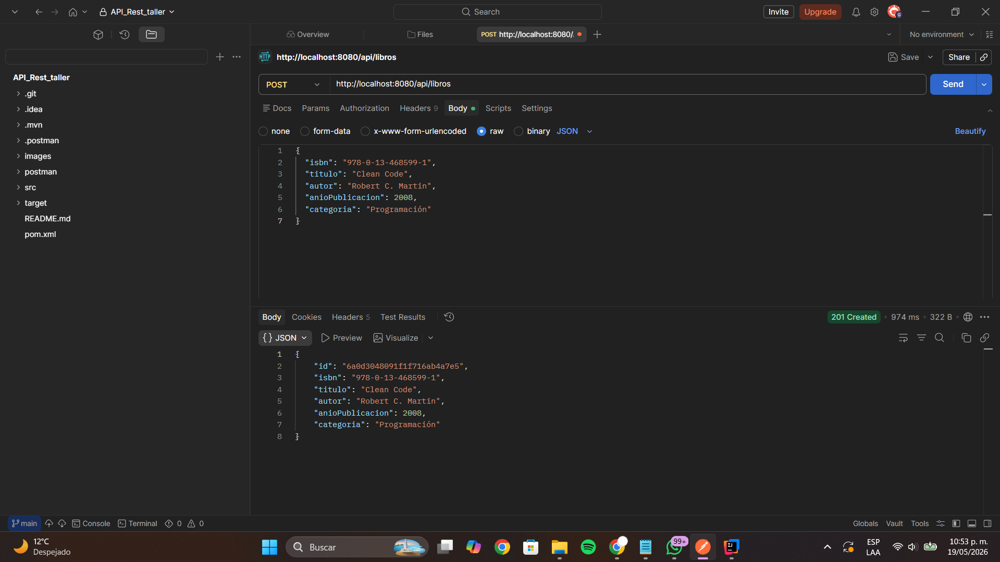
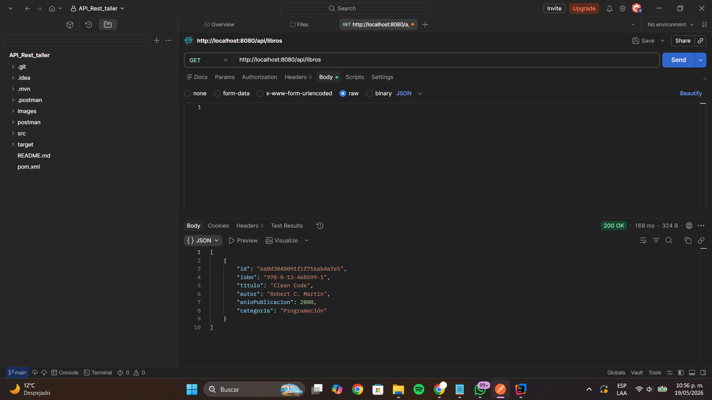
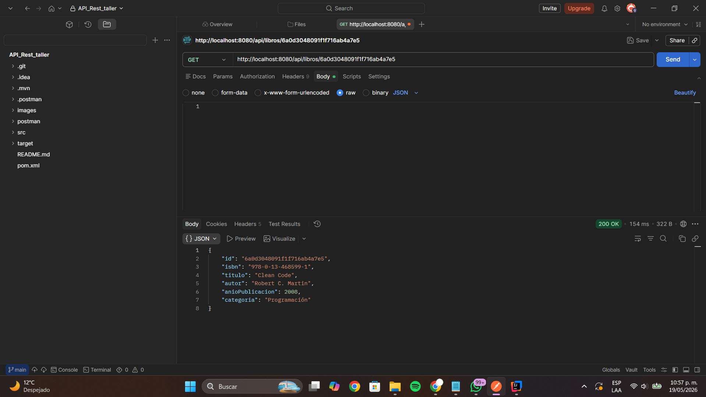
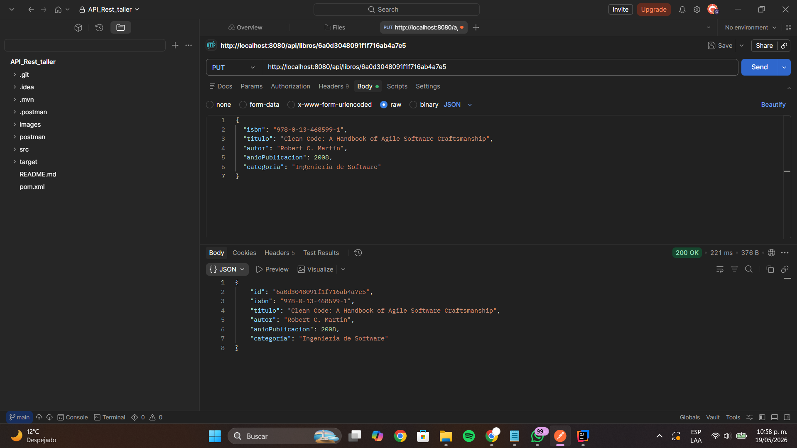
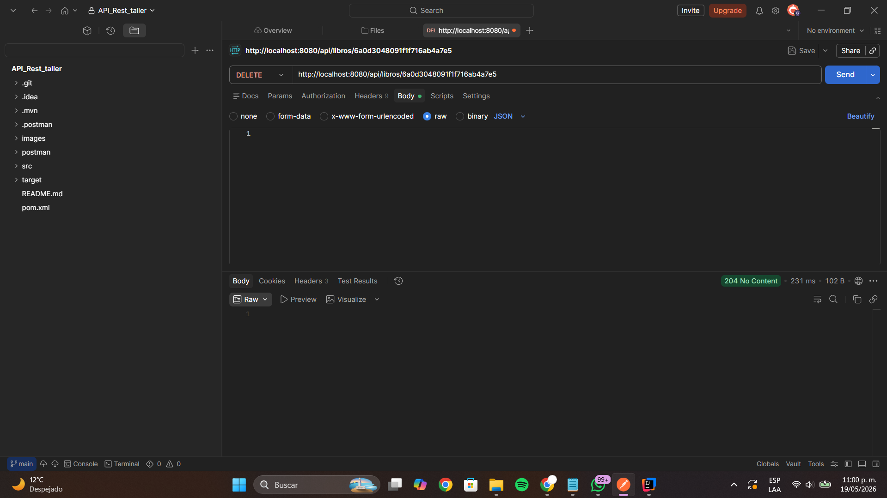

# Biblioteca API REST

Este repositorio contiene mi entrega final del taller de Diseño de Software (4° semestre), donde construí una API REST para gestión de biblioteca usando arquitectura en 5 capas: `Model`, `Repository`, `DTO`, `Service` (interfaz + implementación) y `Controller`. 

El desarrollo se realizó siguiendo este [Tutorial Completo de API REST con Spring Boot](https://github.com).


## Tecnologías que usé

- Java 17
- Spring Boot 3.3
- Spring Data MongoDB
- Lombok
- MongoDB Atlas
- Maven

## Arquitectura del proyecto

Organicé el backend por capas para mantener separación de responsabilidades:

- `controller`: expone endpoints HTTP
- `dto`: define objetos de entrada y salida
- `model`: representa documentos MongoDB
- `repository`: acceso a datos con `MongoRepository`
- `service`: contrato de lógica de negocio
- `service/impl`: implementación de lógica de negocio

Estructura principal:

```text
src/main/java/com/biblioteca
├── BibliotecaApiApplication.java
├── controller
├── dto
├── model
├── repository
└── service
    └── impl
```

## Flujos implementados

Implementé los flujos de:

1. Libro
2. Ejemplar
3. Préstamo
4. Usuario (base para validación de préstamos)

### Regla de negocio clave en Préstamo

- Al crear un préstamo, valido que el ejemplar esté en estado `DISPONIBLE`.
- Si está disponible, cambio estado del ejemplar a `PRESTADO`.
- Al registrar devolución, cambio estado del préstamo a `DEVUELTO`, guardo `fechaDevolucionReal` y regreso el ejemplar a `DISPONIBLE`.

## Configuración de MongoDB

Configuré la conexión con variable de entorno para no dejar credenciales en el código:

```properties
spring.data.mongodb.uri=${MONGODB_URI}
spring.data.mongodb.database=biblioteca_db
```

## Cómo ejecutar el proyecto

1. Definir variable de entorno `MONGODB_URI` con la URI de MongoDB Atlas.
2. Ejecutar compilación:

```bash
mvn clean compile
```

3. Levantar la aplicación:

```bash
mvn spring-boot:run
```

La API queda disponible en:

```text
http://localhost:8080
```

## Pruebas en Postman (Libro)

Usé Postman para validar el CRUD completo de libros:

- `POST /api/libros` crear libro
- `GET /api/libros` listar libros
- `GET /api/libros/{id}` consultar por id
- `PUT /api/libros/{id}` actualizar libro
- `DELETE /api/libros/{id}` eliminar libro

## Evidencias

Creé la carpeta `images/` para anexar capturas de Postman.  
Aquí voy a colocar evidencia de cada prueba:

- `images/postman-01-crear-libro.png`
- `images/postman-02-listar-libros.png`
- `images/postman-03-consultar-libro.png`
- `images/postman-04-actualizar-libro.png`
- `images/postman-05-eliminar-libro.png`

Cuando agregue las imágenes, se verán aquí:







## Resumen final

Con esta implementación entrego una API REST funcional, compilando correctamente, conectada a MongoDB Atlas, con arquitectura por capas y pruebas de endpoints mediante Postman.
